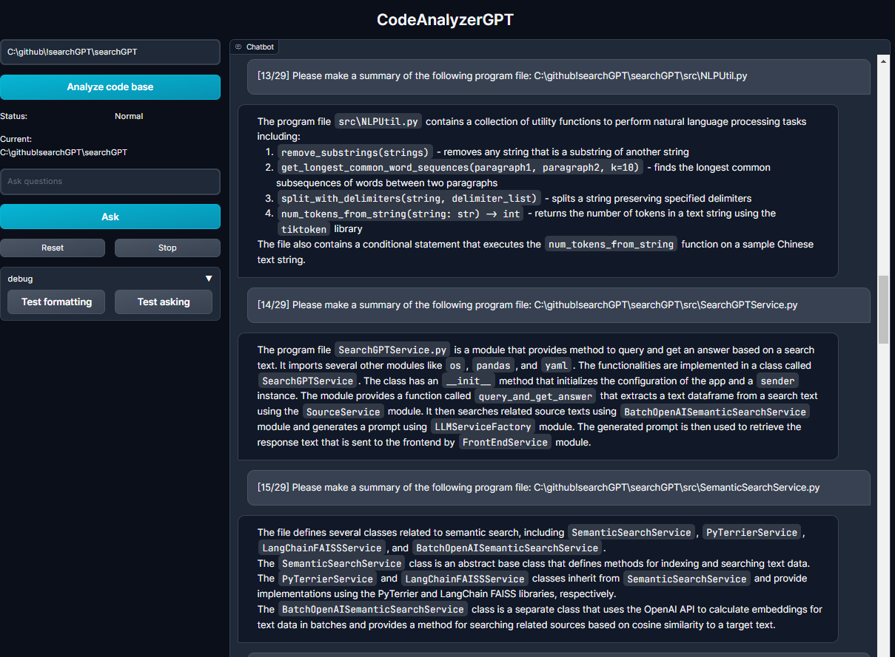

# CodeAnalyzerGPT

CodeAnalyzerGPT is a powerful tool that uses ChatGPT to analyze and generate natural language summaries for projects in
various languages.

It helps developers quickly understand the structure and functionality of a given codebase
by providing explanations for functions, files, and directories.

By leveraging the power of ChatGPT, CodeAnalyzerGPT makes it easy to grasp the overall architecture and dive into
specific components of any Python project.

## Features

- **Call graph extraction**: Generate a call graph from the codebase to assist answering
- **File summaries**: Using ChatGPT to create a comprehensive file summary. Also support compression of prompt when
  exceeding ChatGPT context size
- **Directory summaries**: Combine summaries of each file within a directory to produce a summary for the entire
  directory, recursively up to the root directory.
- **Interactive UI (Gradio)**: Interact with the generated summaries and ask questions about the codebase using a
  Gradio-based UI.

## Images




## Installation

To install CodeAnalyzerGPT, clone the repository and install the required dependencies:

```bash
git clone https://github.com/michaelthwan/CodeAnalyzerGPT
cd CodeAnalyzerGPT
pip install -r requirements.txt
```

Then input OpenAI API key in `config_secret_yaml`

Then run `python main.py` to start the Gradio-based UI.

This will launch the Gradio-based UI, where you can trigger project code scan then ask questions about the codebase.

## License

CodeAnalyzerGPT is released under the MIT License.

## Achknowledgement

This repo's gradio UI heavily reference another github project: github.com/binary-husky/chatgpt_academic/
